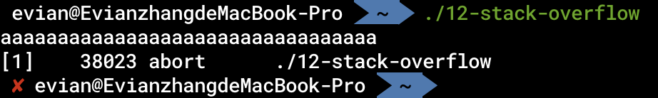

# 函数

在C语言等高级语言中，我们接触函数的概念一定非常多。在初步的印象里，我们往往会觉得函数与跳转并没有什么区别。是的，跳转本质上是将PC设置为目标指令的PC，从而实现控制流的跳转；而函数从表现上来看，也确实就是一个控制流的跳转。那么，函数是不是直接用跳转来做就可以了呢？或者说，与跳转相比，函数有什么独特之处，从而需要我们在汇编层面更加细致地来处理呢？

下面，我就列举一些函数与跳转的不同点。这些不同点，就决定了我们底层在处理函数的时候，需要额外更详细的处理方式。

* 函数在不同的地址被调用之后，返回的地址也不同。

   跳转之后的基本块结束之后去哪里，是固定的：

   ```armasm
   location_a:
       b    target
       ; ...
   location_b:
       b.eq target
       ; ...
   target:
       ; do something
       b    out
   out:
       ; ...
   ```

   无论我们是从`location_a`还是`location_b`跳转到`target`基本块，在`target`基本块执行结束后，继续去哪里是由`target`基本块本身决定的（在这里是去`out`基本块）。

   但是，我们在调用一个函数的时候，在函数执行结束之后，会前往上一层的下一条指令继续执行。这里函数结束之后去哪里，是根据我们调用函数的位置来决定的。
* 函数有参数、返回值
* 函数可以被别的文件里的程序调用

凡此种种，都表明函数是一种更特殊的跳转，其需要我们更细致地处理。

## ABI和调用约定

在正式介绍函数的细节之前，首先我们需要知道ABI，特别是调用约定。

ABI，全称是 _Application Binary Interface_，与API（_Application Program Interface_）对应。我们知道，一般来说，API是在同一个语言编写的程序中，一部分代码调用另一部分代码的方式。例如，我们在使用C语言编写程序的时候，想要实现打开一个文件的功能。而`stdio.h`库提供一个函数：

```c
FILE *fopen(const char *path, const char *mode);
```

我们只需要在我们自己C语言的程序中按照它给出的这个形式，也就是说，调用一个名字叫`fopen`的函数，给它传递两个参数，第一个是代表文件路径的字符串，第二个是代表打开时模式的字符串。在这个函数执行后，会返回一个`FILE *`类型的对象，后续对它进一步操作就行。

但这种API，都是在同一门语言中进行的。我们不需要了解任何二进制层面的东西，只需要在高级语言层面，按照API就能完成「对接」。

在二进制层面，对应API的就是ABI。在二进制层面，怎么调用别人写出来的二进制的代码呢？一般来说，如果通过二进制分发，那么上游的开发者会将程序编译成二进制的库。我们在编写自己程序的过程中，链接对方的库就可以调用对方的代码了。但是这些库中，也就单纯是指令、数据，以及一些符号信息。例如，我在使用Rust语言编写程序的时候，想调用别的开发者使用Go语言开发的库。那么，如果我想调用对方在Go语言中编写的`foo`函数，那么我在Rust语言中直接写`foo`这个名字吗？在Go语言中一个参数是`interface{}`类型，那我在Rust语言中该怎样传递这种参数呢？

这一些问题，仔细一想就会发现，一定会涉及底层的二进制层面。因为无论是什么函数名、是什么类型，最终都会落实到二进制层面的符号、数据、指令。这就是所谓的ABI。同时我们也可以发现，API层面，每个库都有自己的API；在ABI层面，每种语言都有自己的ABI。

一般来说，操作系统的库函数有统一的ABI。除了操作系统、C语言的ABI以外，其他语言的ABI往往都是不稳定的（也有很少的ABI稳定的语言，例如Swift（[ABI Stability and More](https://www.swift.org/blog/abi-stability-and-more/)））。

刚刚我们提到，ABI包含很多二进制层面的「对接」问题，而其中最重要的，就是函数之间的「对接」问题。解决这个问题的部分，被称为「调用约定」（Calling Convention）。ARM制定了自己的ABI标准，称为 _Procedure Call Standard_，可以在[ARM-software/abi-aa](https://github.com/ARM-software/abi-aa)中查看，常被简称为AAPCS for AArch64。而苹果针对这个标准，也进行了一定的增改，提供了自己的标准，可以在[Writing ARM64 Code for Apple Platforms](https://developer.apple.com/documentation/xcode/writing-arm64-code-for-apple-platforms)中查看。

这里的ABI，都是指平台上的C语言与系统库的ABI。在Apple Silicon上的其它语言，并不一定需要遵守这个ABI。

值得指出的是，调用约定与架构标准不同。AArch64架构标准规定，我们在执行`bl`指令后，PC一定会被置于目标函数的地址。而调用约定则**不是和硬件平台绑定的**。我们自己编写的汇编程序，在内部调用我们自己的函数，不一定遵守调用约定。只有在调用外部提供的函数的时候，才需要遵守相对应的调用约定。

在函数部分中，有大量的调用约定与架构标准。为了不引起混淆，我会在后面提到的时候专门指出，哪些是AArch64的调用约定，哪些是AArch64的架构标准。

## 函数的形式

首先，我们看看在汇编语言层面，一个函数长什么样：

```armasm
    .p2align 2
foo:
    ; do something
    ret
```

这就是一个最简单的函数的形式。也就是说，函数的名字和跳转一样，也就是个标签而已。我们在调用函数的时候，可以使用

```armasm
bl    foo
```

和直接跳转非常类似，也是直接跟着一个标签。底层逻辑就是将PC置于函数的首地址。

类似地，间接函数调用（也就是C语言中的函数指针）可以用：

```armasm
blr   x0
```

表示调用`x0`存储的地址对应的函数。

### 对齐

此外，我们应当注意到，在函数之前，我们会声明`.p2align 2`，也就是函数开头应按4字节对齐。这是AArch64的架构要求：

> A64 instructions must be word-aligned.
>
> Attempting to fetch an instruction from a misaligned location results in a PC alignment fault.

也就是说，每一个指令都应当4字节对齐。而由于A64的每一个指令都是定长指令，长度4字节，因此只需要函数开头按4字节对齐，就能保证这个函数内部每个指令都按4字节对齐。

### LR寄存器

那么，这种模式是怎么实现，在哪里调用就能返回到哪里的这个功能呢？

事实上，这里用到了一个特殊的通用寄存器：`r30`。相应的`x30`也被称作LR寄存器，即Link Register。当我们使用`bl`调用函数的时候，LR寄存器会被写入该函数的返回地址。因此，当我们在被调用函数内部使用`ret`指令时，实际上就是将PC设置为LR寄存器的值而已。

## 函数的栈

刚刚我们介绍了函数的相关指令，以及调用函数后，指令空间（也就是PC寄存器）是怎样变化的。接着，我们来看看数据空间是怎样变化的，也就是函数的栈。

### 栈的使用

我们在使用高级语言编程的过程中，函数内部往往会有许多局部变量。而这些局部变量往往都是存储在程序的栈区域里的。我们之前提到过，当操作系统将一个程序载入内存时，会给它分配相应的内存空间，往往会分为指令区、全局变量区、栈区、堆区。我们这里重点用到的就是栈区。

当操作系统将程序载入内存时，会直接分配一大块儿连续的**有效内存**作为栈区。也就是说，在栈区范围内的地址都是有效的。函数可以自由地将栈区内的内存作为自己的局部变量。但是，如果每个函数都随意地找栈空间内的地址作为自己的局部变量，我们没有办法保证这个函数不会用到那个函数已经用到的地址。因此，我们可以遵循一种线性的栈空间的使用方式，同时也就用到了寄存器`sp`。

从每个函数的角度来看，在函数开始的时候，所有函数都会默认，`sp`存储的地址，往上是别的函数已经用过的地址，往下是自己可以用的地址。在调用下一个函数之前，会更新自己的`sp`，将`sp`减小，也就是留出自己的栈空间，防止子函数覆盖自己的栈空间。在函数返回之前，会将`sp`恢复成刚进入函数的模样。

从整体来看，当操作系统分配完栈空间后，会将特殊寄存器`sp`的值置为这个栈空间的顶端的地址（也就是最大的地址）。在函数层层调用的过程中，`sp`的减少代表进入了新的函数，给函数的局部变量留下了空间；`sp`的增加代表函数返回，恢复到上一层的`sp`。

下面，我们就具体来看看在汇编层面的`sp`有什么用。首先，我们来看看示例程序：

```c
void foo() {
    int a;
    char b;
    long c;
    a = 1;
    bar();
}
```

### 栈空间分配

在`foo`内，有一个4字节的局部变量`a`，1字节的局部变量`b`，8字节的局部变量`c`。

第一个问题：在调用`bar`之前，我们要预留多大的栈空间？也就是说，要将`sp`减少多少？

要解决这个问题，我们需要知道几个规则：

* 栈按16字节对齐

   AArch64架构规范从硬件上要求在每一个函数开始的时候，`sp`的值必须是16的倍数。因此，我们将`sp`减小的值，也必须是16的倍数。
* 数据对齐访问性能最好

   这一点之前已经讲过。也就是说，4字节的`a`按4字节对齐，1字节的`b`按1字节对齐，8字节的`c`按8字节对齐，这样性能最好。
* 栈中有16字节的预留位置

   除了局部变量以外，还有16个字节的位置是预留的，分别是存储进入函数时LR寄存器的值和FP寄存器的值。

   FP寄存器之后会提到。这里先解释一下为什么需要存储LR寄存器的值。我们刚刚提到，在使用`bl`指令调用函数的时候，LR寄存器会被赋值为函数的返回地址，`ret`指令也是依靠LR寄存器的值才知道返回到哪里。那么，如果我们在函数内部再一次调用函数时，LR寄存器的值会被覆盖。因此，如果我们不把LR寄存器的值存下来，在返回之前写回去，那函数就返回不了了。所以，我们通用的做法就是，在函数开头，将LR存储到栈上；在函数返回之前，再将栈上的数据写回到函数里。

可以想见，我们可以这样布局函数的栈空间：

```plaintext
 ----------------------       <---------    Previous sp, 16 byte aligned
|  LR register value   |      <---------    8 bytes LR register value
 ----------------------
| old FP register value|      <---------    8 bytes old FP register value
 ----------------------       <---------    Current FP
|        int a         |      <---------    4 bytes variable a
 ----------------------       <---------    Address of a, 4 byte aligned
|        char b        |      <---------    1 byte variable b
 ----------------------       <---------    Address of b, 1 byte aligned
|       Padding        |      <---------    3 bytes padding
 ----------------------
|        long c        |      <---------    8 bytes variable c
 ----------------------       <---------    Address of c, 8 byte aligned. Current sp, 16 byte aligned
```

也就是说，栈空间为32字节，我们在函数开头的时候可以将`sp`减小32。从而`a`的地址为`sp + 12`，`b`的地址为`sp + 11`，`c`的地址为`sp`。

值得指出，LR和FP组成的预留位置，在AArch64的ABI中并没有明确规定其在函数栈空间的位置。在Apple Silicon中，它位于栈的底部（也就是高地址区域）。

和通用寄存器一样，我们的特殊寄存器`sp`也可以参与`add`、`sub`之中。在函数开始的时候，我们可以减小`sp`：

```armasm
foo:
    sub    sp, sp, #32
```

在函数返回之前，再把`sp`复原：

```armasm
add    sp, sp, #32
ret
```

访问栈上的局部变量的时候，可以使用在[内存交互](./10-内存交互.md)一章中介绍的「基寄存器+常数偏移」的寻址模式。`a = 1`可以翻译为

```armasm
mov    w8, #1
str    w8, [sp, #12]
```

### 帧指针FP寄存器

刚刚我们提到，AArch64调用约定规定，在函数栈上，除了LR寄存器之外，我们还需要存储FP寄存器。FP寄存器，实际上就是`r29`寄存器。FP寄存器是做什么用的呢？我们先不说，下面来介绍一下FP寄存器在函数调用的过程中是怎么用的。通过用法，我们就可以知道FP寄存器是做什么的了。

* 在函数开始的时候，同LR寄存器一样，我们需要把当前的FP寄存器的值存在栈上。随后，将当前栈顶指针`sp`的值赋给FP。也就是说，此时FP寄存器的值，指向的就是之前FP寄存器值存储在栈上的地址。
* 在函数返回的时候，将栈上FP的值再写回FP寄存器。

通过这种做法，FP可以帮助我们做以下的工作：

#### 访问栈上变量

首先，FP可以帮我们访问栈上变量。我们之前提过，可以通过`sp`+偏移的方式访问局部变量。但是我们知道，在函数内部，`sp`的值有可能不断变化。那么，计算出相应的偏移也是给编译器增加负担。而FP指向的值是固定的，我们从而可以通过FP为基寄存器，访问局部变量。

例如，在上面的例子中，我们可以通过`sp + 12`获得`a`的地址。同理，我们也可以通过`fp - 4`获得`a`的地址：

```armasm
mov    w8, #1
str    w8, [x29, #-4]
```

#### 回溯函数调用栈

当我们分析程序，或者其他特殊情况的过程中，可以根据FP来回溯函数调用栈。这是什么意思呢？我们可以用一个C语言的结构体来解释，通过FP，函数的栈帧可以粗略地理解成这样一个结构体：

```c
struct StackFrame {
    unsigned long ret_addr;
    struct StackFrame *previous_stack_frame;
    char remain[];
};
```

存储在栈上的FP的值可以看作指向前一个函数栈帧的指针，从而函数的栈帧成了一个链表。我们可以通过这个链表，回溯函数的调用栈。

### Prologue与Epilogue

根据我们上面的叙述，在函数调用的过程中，总会涉及到将LR、FP寄存器存到栈上等等操作。这些操作是固定的，在函数开头执行的操作被称为Prologue，在函数返回前执行的操作被称为Epilogue。

#### LR、FP寄存器与栈交互

在Prologue中，我们需要将LR、FP寄存器存入栈上；在Epilogue中，我们需要将栈上数据读入LR和FP中。

这种成对的数据内存读写，AArch64为我们提供了`stp`和`ldp`指令：

```armasm
stp    x29, x30, [sp]
```

表示将`x29`存储到`sp`，`x30`存储到`sp + 8`；

```armasm
ldp    x29, x30, [sp]
```

表示将`sp`读取8字节至`x29`，`sp + 8`读取8字节至`x30`。

#### 完整代码

了解了`stp`和`ldp`之后，我们就可以知道函数Prologue与Epilogue的完整代码了。以上面的C语言程序`void foo`为例。

##### Prologue

```armasm
_foo:
    sub    sp, sp, #32
    stp    x29, x30, [sp, #16]
    add    x29, sp, #16
```

##### Epilogue

```armasm
ldp    x29, x30, [sp, #16]
add    sp, sp, #32
ret
```

### 栈溢出攻击

在刚刚阐述LR寄存器的时候，我们可以发现一点：

* 在函数开头，把LR存栈上
* 在函数返回前，从栈上读数据，存储到LR中
* 函数返回时，根据LR的值，决定执行哪条指令

那我们如果在函数执行的过程中，修改栈上的数据，是不是就可以控制程序的控制流了！事实上，确实是这样的。我们来看一个最简单的程序（[codes/12-stack-overflow.c](https://github.com/Evian-Zhang/learn-assembly-on-Apple-Silicon-Mac/blob/master/codes/12-stack-overflow.c)）：

```c
int main() {
    char buf[16];
    scanf("%s", buf);
    return 0;
}
```

在`scanf`的过程中，并没有对输入的长度进行判断。那么我们如果不停地输入`a`，会发生什么情况呢？



程序崩溃了！仔细想想也是理所当然的，`buf`的地址在LR在栈上的地址之下，我们不断向`buf`中填充数值，肯定会覆盖到LR在栈上的位置。从而在函数返回时，`ret`返回的地址就变成了我们输入的值，如果是无效地址，就崩溃了。

真正的攻击则是会在执行时算好地址，从而能够劫持控制流。之前介绍的ASLR、PIC等方案，就是通过随机化地址的方式，让攻击者难以算出真正的地址，从而只能导致程序崩溃，而不是让程序执行自己想要的指令。

## 参数和返回值的传递

在上面的叙述中，我们忽略了函数的参数以及返回值的传递问题。在汇编指令中，`bl`、`ret`的语义完全没有涉及到参数和返回值，那我们该如何实现参数及返回值的传递呢？

事实上，参数和返回值的传递并不在机器指令层面实现，而是在汇编语言中，一种约定，也就是属于之前介绍的「调用约定」。

这里，我们主要介绍整型的调用约定。对于浮点型等其他类型，我们之后会专门介绍。

### 参数传递

我们可以写一个简单的程序观察一下（位于[codes/12-argument-passing.c](https://github.com/Evian-Zhang/learn-assembly-on-Apple-Silicon-Mac/blob/master/codes/12-argument-passing.c)）：

```c
extern void
foo(int a1, int a2, int a3, int a4, int a5, int a6, int a7, int a8, int a9, int a10);

void bar() {
    foo(1, 2, 3, 4, 5, 6, 7, 8, 9, 10);
}
```

我们检查其汇编代码，在`foo`函数内部，我们可以看见：

```armasm
mov    w0, #1
mov    w1, #2
mov    w2, #3
mov    w3, #4
mov    w4, #5
mov    w5, #6
mov    w6, #7
mov    w7, #8
mov    x9, sp
mov    w8, #9
str    w8, [x9]
mov    w8, #10
str    w8, [x9, #4]
bl     _foo
```

从中，我们可以验证AArch64调用约定下，整型参数传递的方法：

* 对于从左往右前8个参数，第`n`个参数就放到`r[n]`中，例如第1个参数放在`r0`寄存器
* 剩下来的参数，从右往左压栈

第一条规则十分直白，也容易观察。这里再解释一下第二条规则。我们可以发现，数字9，也就是第9个参数，是放在`sp`指向的位置；而第10个参数是放在`sp + 4`的位置。我们之前提到过，在Apple Silicon中，栈是由高地址向低地址增长。因此，我们可以这样理解这种操作：先将第10个参数压栈，再将第9个参数压栈。

为什么要这样做呢？我们之前提到，参数传递是一种调用约定。对于我们编写的高级语言来说，具体怎样做参数传递是编译器决定的。对于一般的函数而言，从右往左压栈还是从左往右压栈并没有什么区别，在调用这个函数时，以及这个函数内部，编译器都可以根据高级语言中的信息，构造参数传递的顺序。

但是，对于可变参数的函数来说，问题就发生了变化。我们最熟悉的可变参数函数就是`printf`了：

```c
int printf(const char *format, ...);
```

如果我们的`format`参数是`"Hello world"`，那么这个函数只有1个参数；如果`format`参数是`"Hello %d %s %d world"`，那么这个函数应该有4个参数。

这种函数的特点就是，在编译期，调用函数的时候我们可以知道这个函数有几个参数，但是在函数内部，是不知道具体有多少个参数的。只有在运行期，函数内部检查`format`参数，才知道究竟有多少个参数。

在编译期参数个数不确定会有什么问题呢？在被调用的函数内部，我们需要按照函数自己的语义，检查一共需要有多少个变量。对于`printf`来说，这个语义就是其第一个参数。按照正常人类的逻辑，这个语义肯定不会是最后一个参数，也不会是从右往左数的参数。那么如果这个参数在第9位，第10位，也就是超过了前8位，那么这个参数就会被传递到栈上。这时就出现了问题。如果从左往右压栈，那么这个语义会在高地址位。而由于我们在检查这个语义之前，不知道有多少个参数，因此我们也无法知道这个语义在什么位置。从右往左压栈就没有这个问题了。

这里还要表明一点的是，上述的这种可变参数函数传参的方式（也就是和不可变函数传参方式一样，前8个放寄存器，后面的从右往左压栈）是AArch64调用约定。对于Apple Silicon来说，有一些区别。对于可变参数函数来说，其参数可以分为不可变参数和可变参数。例如，对于`printf`来说，第一个参数`format`属于不可变参数，其余的属于可变参数。那么，即使不可变参数个数少于8个，可变参数仍然总会通过栈来传递。

此外，还有一点需要注意。之前我们提到，AArch64标准要求函数开始是栈按16字节对齐。因此，Apple Silicon的ABI也要求我们，在传递参数时，要保证即使通过栈传递，在子函数开始时栈仍然是16字节对齐。

### 返回值传递

我们写习惯了C语言等高级语言之后，一般设计一个函数时，返回值只有一个。在AArch64的ABI中，这个返回值会通过`r0`寄存器来传递。这也是为什么我们在[第一个汇编程序](./5-第一个汇编程序)一章中，通过向`w0`赋值，可以在命令行中程序的返回结果里看到相应的值。

但事实上，一个函数可以有多个返回值。返回值的传递和参数传递类似，第一个返回值放在`r0`寄存器里，第二个返回值放在`r1`寄存器里。

在libc中，有一个函数是`lldiv`，其接收两个参数，将这两个参数相除，返回商和余数。使用这个函数的时候，我们就可以注意到，商会放在`x0`里，余数会放在`x1`里（在C语言中被表现成了返回一个结构体）。

## 寄存器处理

我们知道，`r0`到`r30`被称作通用寄存器，理论上我们可以任意地用它们存放任意值。在AAPCS的ABI下，`r0`到`r7`被用作传递参数和返回值，`r29`和`r30`分别是FP和LR。那是不是剩下的寄存器我们都可以随便用了呢？

如果我们可以随便用，那一样的，我们调用的别的库的作者也可以在他写的函数里随便用这些寄存器。那么，如果我们在自己的函数中，例如用`x16`存放了一个值。那么，在调用了另外一个库的某个函数之后，我们怎么知道，`x16`没有被这个函数内部篡改？

因此，为了解决这一矛盾，AAPCS规定了「被调用者保留的寄存器」（Callee-saved Registers）。在任何一个函数返回时，`r19`到`r28`寄存器的值必须和这个函数刚开始的时候相同。也就是说，这个函数应该保留这些寄存器。对于调用这个函数的调用者来说，应该放心地使用这些寄存器，而不用担心值被子函数篡改。因此，我们在存储中间值的时候，应该尽量避免使用`r19`到`r28`的值，同时也不应假定被调用函数不会修改其它寄存器的值。因此，最保险也是最方便的方法，就是把一些中间值存在栈上，在调用完函数之后，再从栈上读回来。

同时，Apple Silicon还规定了，`r18`寄存器为「平台保留的寄存器」（Platform-reserved Register），我们不应使用这个寄存器。

## 斐波那契数列

最后，我们来用汇编写一个递归的斐波那契数列，作为函数部分的总结（完整代码[codes/12-fibonacci.s](https://github.com/Evian-Zhang/learn-assembly-on-Apple-Silicon-Mac/blob/master/codes/12-fibonacci.s)文件）：

```armasm
    .p2align    2
fibonacci:
    sub    sp, sp, #32
    stp    x29, x30, [sp, #16]
    add    x29, sp, #16
    str    w0, [x29, #-4]
    cmp    w0, #2
    b.lt   init_val
    sub    w0, w0, #1
    bl     fibonacci
    str    w0, [x29, #-8]
    ldr    w0, [x29, #-4]
    sub    w0, w0, #2
    bl     fibonacci
    ldr    w1, [x29, #-8]
    add    w0, w0, w1
    ldp    x29, x30, [sp, #16]
    add    sp, sp, #32
    ret
init_val:
    mov    w0, #1
    ldp    x29, x30, [sp, #16]
    add    sp, sp, #32
    ret
```
