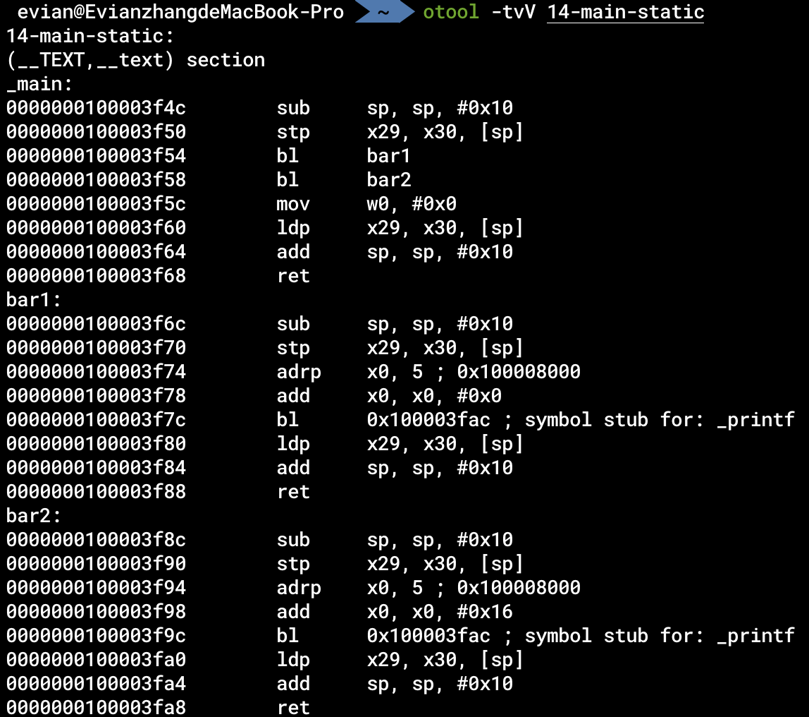
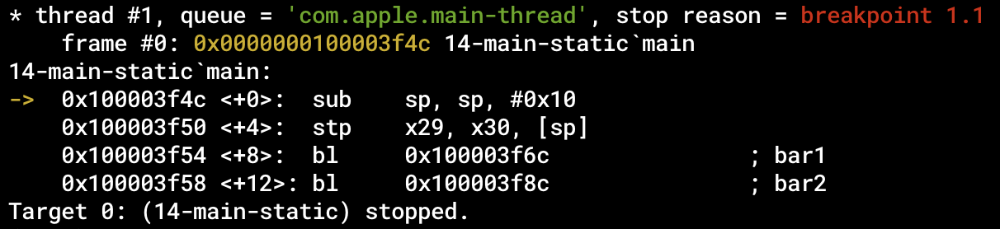
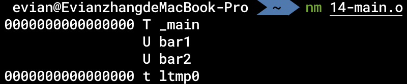

# 汇编、链接与调试

在这一章中，我们主要介绍的是汇编、链接与调试的全过程的原理。

## 汇编与链接

在[第一个汇编程序](./5-第一个汇编程序.md)中，我们介绍了怎样由汇编代码生成可执行程序。它主要包括两个阶段：

汇编：

```bash
as foo.s -o foo.o
```

链接：

```bash
ld foo.o -lSystem -L `xcrun --show-sdk-path -sdk macosx`/usr/lib -o foo
```

在汇编程序生成可执行程序的过程中，为什么需要分为汇编和链接两步呢？这两步分别是做什么的呢？

在Unix刚刚发明的时代，开发者在编写软件时有一个理念：一个程序只做一件事。在这里，汇编器的作用实际上是将汇编代码`foo.s`转化为机器指令，生成的`foo.o`被称为目标文件（Object file），其中包含的大部分机器指令实际上和可执行程序`foo`中包含的一样。也就是说，`foo.o`中也存在`__text`节，也存在`__data`节。但是，我们知道，在编写实际的大型软件的过程中，几乎不存在所有代码都在一个文件中的情况。往往一个大型项目会包含许多项目源文件。那么汇编器将每一个源文件都翻译为存储有相应机器指令的目标文件，可是最终的可执行文件只有一个，所以这里就需要链接器。链接器分析每一个目标文件的相应的段和节，将其提取、拼接，最终生成一个可执行文件。

这就是汇编和链接的一个大致的过程，汇编将汇编语句翻译为机器指令，链接将多个目标文件合并为一个可执行程序。但是，这其中实际上还有非常多的问题，我们将在这章中解释。

这章的例子包含三个文件：[codes/14-foo1.s](https://github.com/Evian-Zhang/learn-assembly-on-Apple-Silicon-Mac/blob/master/codes/14-foo1.s)、[codes/14-foo2.s](https://github.com/Evian-Zhang/learn-assembly-on-Apple-Silicon-Mac/blob/master/codes/14-foo2.s)和[codes/14-main.s](https://github.com/Evian-Zhang/learn-assembly-on-Apple-Silicon-Mac/blob/master/codes/14-main.s)。前两者分别定义了函数`bar1`和`bar2`，这两个函数分别会输出"This is bar1 in foo1"和"This is bar2 in foo2"。在main中调用了这两个函数。

## 静态链接与动态链接

### 静态链接

刚刚我们提到，链接器可以将多个目标文件合并生成一个可执行程序。在实际软件开发的过程中，我们往往会用到别人编写的库，我们也有可能自己编写一个库，给别人使用。那么，按照上面的逻辑，我们编写的库实际上也可以看作一种特殊的“目标文件”，在给别人使用的过程中，别人通过链接器，将我们使用的库一起组合生成一个可执行文件。这就是「静态链接」的概念。

具体而言，针对本章的例子，我们使用汇编器将`14-foo1.s`和`14-foo2.s`分别翻译为对应的目标文件`14-foo1.o`和`14-foo2.o`之后，可以使用

```bash
ar rcs lib14-foo-static.a 14-foo1.o 14-foo2.o
```

这个命令会将刚刚生成的这两个目标文件合并为静态库`lib14-foo-static.a`。

我们在`14-main.s`中使用了这个库，所以在把它翻译为`14-main.o`之后，我们要在链接时把这个库一块儿链接上：

```bash
ld -L. 14-main.o -l14-foo-static -lSystem -L `xcrun --show-sdk-path -sdk macosx`/usr/lib -o 14-main-static
```

可以发现，它主要多了`-L.`和`-l14-foo-static`这两个选项。`-l14-foo-static`选项会使链接器在搜索路径下搜索`lib14-foo-static.a`文件，找到后一起链接；`-L.`则将当前目录添加到搜索路径下，使链接器可以找到我们刚刚生成的静态库。

对于这种静态链接生成的程序，我们可以使用

```bash
otool -tvV 14-main-static
```

反汇编。通过反汇编，我们可以发现，静态链接就是直接把库的代码放到可执行程序中，我们在`14-main-static`这个可执行程序中找到了`bar1`和`bar2`的代码：



### 动态链接

我们在使用静态链接的过程中，往往会发现一些问题：

* 重复的库占用内存、硬盘

   有些库非常常用，许多开发者写的程序都需要这些库。如果这些库本身的体积很大，而静态链接会把这个库链接到每一个程序中，就会导致这些程序都存在极为庞大的重复代码。无论是存储在硬盘中，还是载入到内存里，都会占用很大的空间。我们自己写的库有可能很小，只有几KB，但是像Electron这种大型的GUI框架，也有不少人吐槽其体积问题（[electron/electron #673](https://github.com/electron/electron/issues/673)）。
* 更新困难

   如果想要给用户更新自己编写的程序，那么最简单的方法就是把新编译的程序替换旧编译的程序。可是对于大型的应用来说，一次更新就需要用户下载几百M甚至几个G的内容，会很麻烦。


针对这些问题，我们拥有了动态链接技术。不过这里要指出，动态链接并不是一定比静态链接好。只是针对不同的情况，可以采取不同的策略。

动态链接的思想也很直接：我们将库变成独立的动态链接库，不再直接放到可执行程序里。如果多个程序用到了同一份库，那我们只需要一个动态链接库就行，让多个程序链接这个库。在更新软件时，如果需要更新的内容是动态链接库里的，那就直接把更新的动态链接库发送给用户，不需要改主程序。

具体而言，我们得到目标文件`14-foo1.o`和`14-foo2.o`之后，将其链接为动态链接库：

```bash
ld 14-foo1.o 14-foo2.o -lSystem -L `xcrun --show-sdk-path -sdk macosx`/usr/lib -dylib -o lib14-foo-dynamic.dylib
```

也就是说，在链接时增加`-dylib`选项。

在生成最终可执行程序时，和静态链接类似：

```bash
ld -L. 14-main.o -l14-foo-dynamic -lSystem -L `xcrun --show-sdk-path -sdk macosx`/usr/lib -o 14-main-dynamic
```

同样是加`-L.`和`-l14-foo-dynamic`，这个`-l`选项会同时搜索`.a`和`.dylib`。

值得指出的是，正如静态链接和动态链接的名字所指示的，静态链接就是在编译时将库的代码直接放到可执行程序内部，而动态链接是在执行可执行程序的过程中，将动态链接库载入内存。如果有多个程序动态链接到了同一个库，那么在载入这些程序到内存的过程中，会将动态链接库所在的同一张物理页映射到这些程序的进程空间中。也就是说，这些进程的内存空间实际上有共同的一部分物理内存，这部分就是动态链接库所在的物理页。这种方式就可以减小内存占用，同时也是一些现代的处理器层面的攻击手段（如熔断、幽灵漏洞等）得以攻击的途径。

### 静态链接程序与动态链接程序

与静态链接（static linking）、动态链接（dynamic linking）这种链接的方式对应的，也有静态链接的程序（statically-linked binary）与动态链接的程序（dynamically-linked binary）。静态链接的程序就是指不依赖任何动态链接库的程序，其余的程序则是动态链接的程序。

我们平常编写的程序都是动态链接的程序。一个最普通的Hello world的程序，依赖什么动态库呢？最主要的，还是依赖libc。之前我们提到，大部分常用的系统调用都有libc的封装，而我们常用的一些C语言的库函数如`strlen`、`fopen`等，也都是由libc提供。我们在链接时加上的`-lSystem`实际上就是表明我们的程序动态依赖libc库。

macOS一般不支持静态链接的程序。在理论上，静态链接和动态链接的汇编程序及C程序实际上是需要startup codes的，一般被称为C Runtime，简写为crt。crt是用来做什么的呢？我们知道，`main`函数可以用参数：

```c
int main(int argc, char **argv);
```

这些参数承载命令行参数相关的信息。这些参数的传递实际上就是由crt处理的。除此之外，crt也负责TLS的初始化等工作。因此，在汇编层面来看，静态链接的程序的开始并不是`main`函数，而是crt的开始，一般为`start`函数。我们可以简单看一下在Linux系统上，`start`函数是怎么调用`main`函数的：

对于glibc来说，我们可以在`sysdeps/generic/libc_start_call_main.h`文件中看到：

```c
_Noreturn static __always_inline void
__libc_start_call_main (int (*main) (int, char **, char ** MAIN_AUXVEC_DECL),
                        int argc, char **argv MAIN_AUXVEC_DECL)
{
  exit (main (argc, argv, __environ MAIN_AUXVEC_PARAM));
}
```

类似地，对于LLVM提供的libc来说，我们可以在`libc/loader/linux/x86_64/start.cpp`文件中看到：

```c
extern "C" void _start() {
  // ...
  __llvm_libc::syscall(SYS_exit,
                       main(args->argc, reinterpret_cast<char **>(args->argv),
                            reinterpret_cast<char **>(env_ptr)));
}
```

在将命令行参数传递给`main`函数之后，使用其返回值作为`exit`的参数进行退出。

## 调试

除了汇编、链接之外，与我们开发软件息息相关的就是调试技术了。所谓的调试，就是使用调试器监控进程的运行，可以设置断点、单步调试等等。

对于本章的例子，我们在生成`14-main-static`可执行程序之后，可以使用LLDB对其进行调试：

```bash
lldb ./14-main-static
```

我们可以首先使用

```bash
(lldb) breakpoint set --name main
```

设置断点。

然后使用

```bash
(lldb) run
```

运行程序。

当程序执行到`main`函数开头的时候，就会自动暂停：



随后，我们可以使用

```bash
(lldb) register read
```

查看此时所有寄存器的值。我们也可以使用别的指令进行别的运行时操作。

最后，使用<kbd>ctrl</kbd>+<kbd>D</kbd>退出LLDB。

那么，调试是怎么实现的呢？我们首先来看看调试时设置断点的过程：

1. 调试器进程对被调试进程特定指令地址设置断点
2. 被调试进程执行到断点时，暂停执行
3. 控制权交还调试器进程

在操作系统层面，这个是由`ptrace`系统调用实现的。调试器进程通过这个系统调用，告诉内核被调试的进程，以及一个中断信号。如果被调试进程发出该中断信号，则内核将控制权交给调试器进程。

那如何使被调试进程发出中断信号呢？这需要从处理器层面进行考虑。[官方文档](https://developer.arm.com/documentation/102140/0200/Breakpoints)中一共给出了两种方案：

* 软件断点

   被调试进程在断点位置的指令被替换为`bkpt`指令。当执行到该指令时，会发出特定的中断信号。
* 硬件断点

   AArch64架构有若干硬件调试寄存器。当执行的指令满足某些设定的条件时（如指令地址等于存储在调试寄存器中的值），发出特定的中断信号。

## 符号

我们介绍完了静态链接、动态链接与调试之后，有一个问题其实一直被我们掩盖了：这些过程中是如何解析符号的？

* 在静态链接时，`14-main.o`需要`bar1`和`bar2`这两个函数，但是在生成这个目标文件的时候，我们并不知道这两个函数的地址。因此在编码相应`bl`指令的时候，其操作数必然不能确定。链接器在将目标文件合并生成可执行文件时，需要将对这两个函数的调用处的编码修改为对应的正确的地址。
* 在生成动态链接的程序时，`14-main-dynamic`可执行程序也不知道`bar1`和`bar2`的地址，我们在将程序载入内存时，动态链接器才可以把相应的地址告诉进程。
* 在调试程序时，我们想在`main`函数下断点。可是我们如何知道这个可执行程序中哪一个地址是`main`函数的地址？

这三个问题的核心，就是我们这一节需要讲的「符号」（Symbol）。

### 符号表

我们在汇编程序中，写的绝大部分标签（Label），在生成目标文件时，都会在二进制程序的符号表中存储相应的符号。我们可以使用

```bash
nm 14-main.o
```

查看二进制程序中的符号：



可以看到，`bar1`和`bar2`确实**以字符串的形式**存储在了二进制程序的符号表中。

### 重定位

在生成目标文件时，我们会将所有在汇编时无法确认地址的符号（包括不定义在这个文件中的函数，以及我们之前提到的`@PAGE`、`@PAGEOFF`等等）放到重定位表中。我们在使用`nm`查看符号表的时候，前面的"U"就代表这个符号目前无法确认地址，需要重定位。在静态链接的过程中，链接器会查看所有被链接的目标文件的符号。例如，会根据`14-main.o`的重定位表，得知其需要`bar1`和`bar2`这两个符号。在得知`lib14-foo-static.a`这个库中提供了`bar1`和`bar2`这两个符号之后，就可以使用正确的地址去修改在`14-main.o`中的函数调用语句，将其地址替换为正确的地址。

### 动态绑定

与静态链接时的重定位类似，我们是不是可以用同样的手法解决动态链接时的符号（被称为间接符号）解析呢？也就是说，我们可不可以这样：对于静态链接时没找到的符号，生成一个类似重定位表的东西，告诉动态链接器哪个地址的指令需要重写。在载入内存后，动态链接器解析符号然后重写地址。

这么做理论上时可以的，但是我们知道，在静态链接时花多少时间都是无所谓的，毕竟都只是花开发者的时间；但是在动态链接时，也就是执行程序的时候，每一分每一秒都花的是用户的时间。因此，我们应该尽可能地减少动态链接所需的时间。按上述的方案，有几个问题：

* 多处指令调用同一个外部函数

   如果有多个指令都调用了同一个外部函数（比如`printf`），那么按上述方案，动态链接器需要使用同一个地址重写这么多指令，造成冗余。
* 不会被执行到的指令调用外部函数

   有一些指令只是被静态链接到了可执行程序中，但实际上是不会被执行到的。那么如果这些指令也被重写，则会造成冗余。

为了解决这种情况，我们引入了延迟绑定和GOT表。

#### 动态绑定过程

以本章的例子为例，在生成`14-main-dynamic`可执行程序的时候，实际生成的程序可以粗略地理解成（以对`bar1`的调用为例，省略对`bar2`的调用）：

```armasm
    .section __TEXT, __text
    .globl  _main
    .p2align    2
_main:
    sub    sp, sp, #16
    stp    x29, x30, [sp]
    bl     bar1_stub
    mov    w0, #0
    ldp    x29, x30, [sp]
    add    sp, sp, #16
    ret

    .section __TEXT, __text
    .p2align bar1_stub
bar1_stub:
    adrp   x16, bar1_sym@GOTPAGE
    add    x16, x16, bar1_sym@GOTPAGEOFF
    br     x16

    .section __DATA, __got
    .p2align 4
bar1_sym:
    .quad some_addr
```

链接器首先会在`__TEXT`段的`__stubs`节生成若干个桩函数，在原来对`bar1`、`bar2`的调用处的指令，实际上被替换为了对对应的桩函数的调用。

在桩函数中，会间接跳转到某些地址上。这些地址一般存储在`__DATA`段的`__got`节，或者存在`__la_symbol_ptr`等节中。一般而言，这节中的这些地址，一开始是动态链接器的某些函数的地址。因此在第一次调用到桩函数的过程中，会调用到动态链接器的函数。动态链接器此时解析相应的符号，然后把`__got`节（或者别的类似的节）中的地址重写为真正的解析到的函数的地址。

通过上述的方案，在第二次再调用到同一个桩函数时，由于其存储在`__got`节的地址已经被改写为正确的地址，就不再需要动态链接器的参与；同时，由于只在第一次调用时才会用动态链接器解析符号、重写地址，因此避免了不会被调用到的指令产生冗余解析的问题。

#### 静态链接时的动态链接库

通过上述的过程，我们可以发现，静态链接生成`14-main-dynamic`时，似乎不需要动态链接库。但是我们给出的静态链接的过程中，依然需要在命令行里给出相应的动态链接库。这是为什么呢？Stack Overflow上也有人提出了类似的问题：[why do we need the shared library during compile time](https://stackoverflow.com/q/48770958/10005095)。

事实上，在静态链接时提供动态链接库主要有两个原因：

* 在生成的可执行程序中存储动态链接库的名字

   在静态链接时，对于该可执行程序执行时需要的动态链接库，我们显式地给出来，链接器会把这些动态链接库的名字存储在可执行程序内。在执行时，动态链接器就可以根据这些名字，直接将相应的动态链接库载入内存。

   我们可以通过

   ```bash
   otool -L 14-main-dynamic
   ```

   查看一个动态链接的程序内记录的动态链接库的名字。
* 确保所有符号都会被解析

   如果有的符号在动态链接库中也不存在，那么执行时动态链接器就没办法解析相应的符号，造成崩溃。因此，在链接时可以直接检查是不是所有没定义的符号都在动态链接库中，从而减小开发者失误的可能性。

因此，我们可以发现，在静态链接时，实际上只需要给出动态链接库的名字以及动态链接库提供的符号。因此，在最近的新版本的macOS中，所有的系统库都采用了`.tbd`文件的形式存储在硬盘中。这些`.tbd`文件只含有动态链接库的名字和其中的符号，不含有实际指令。通过这种方案，减小了SDK在硬盘中的体积，也减小了系统库被逆向的可能性。

### 调试符号

在使用调试器进行调试的时候，我们就可以根据符号表中的符号进行调试。这就是为什么我们可以在下断点的时候直接说「对`main`函数下断点」而不需要给出具体的地址。

值得指出，现在的调试技术非常强大，因此除了符号表以外还会有很多额外的信息。在macOS上，如果我们使用C语言等高级语言进行编译时指定了生成调试文件的选项，就会产生一个`.dSYM`的文件。文件中会以DWARF格式存储我们所需要的调试信息。更详细的内容可以看Apple WWDC中的Session [Symbolication: Beyond the basics](https://developers.apple.com/videos/play/wwdc2021/10211/)。

### 可见性

在开始的时候我提到，绝大多数我们写的标签都会变成符号存储在二进制程序中。是不是所有的标签都会变成符号呢？事实上，在链接器层面，维护了一个基本的访问控制方案。

* 所有以`L`或`l`开头的标签

   这一部分标签将不会出现在符号表中。一般我们在控制语句中的标签以及一些字符串常量的标签都会采用此种形式。（这个规定我并没有找到实际的文档，只在LLVM的源码中找到了对应的检查：`lld/MachO/SyntheticSections.cpp`的`SymtabSection::finalizeContents()`函数）
* 其它不用`.globl`声明的标签

   这一部分标签将会以局部符号的形式出现在符号表中。这一部分符号对于其它目标文件是不可见的。也就是说，如果我们不以`.globl`标记`bar1`和`bar2`，我们在静态链接时是无法正确链接的。
* 以`.globl`声明的标签

   这一部分标签会以全局符号的形式出现在符号表中，可以被其它目标文件中的未定义符号解析。
