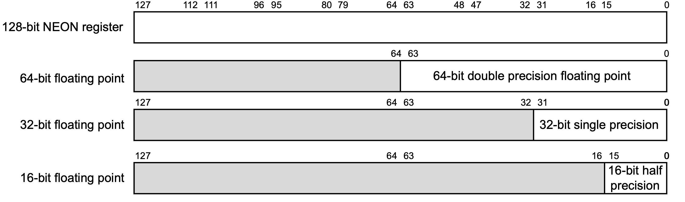

# 浮点数与SIMD

在本教程的最后，我们将介绍浮点数与SIMD。这一章的内容在平时的汇编语言开发、程序逆向过程中不怎么常见，但是也是不可或缺的一部分。

## 浮点数

在AArch64架构中，一般采用32个128位的SIMD与FP寄存器（这种寄存器的名字就叫做「SIMD与FP寄存器」（SIMD and FP register））来存储浮点数：



一般来说，在浮点数的处理过程中，我们常用的是其中的32位部分和64位部分，分别对应了C语言中的单精度浮点型`float`与双精度浮点型`double`。关于这两种类型的编码、特性，我们在[底层的浮点数](./2-底层的浮点数.md)一章中已经介绍过了。

对32位浮点型寄存器的引用，可以使用`s`，64位则使用`d`。例如，`s1`代表第2个SIMD与FP寄存器的32位部分，`d3`代表第4个SIMD与FP寄存器的64位部分。除此之外，16位的浮点型寄存器可以使用`h`，128位的则可以使用`q`。

与整型类似，SIMD与FP寄存器之间也可以按照浮点数的运算法则进行算术运算，其对应的汇编指令只需要在前面加上`f`。例如：

```armasm
fadd    s1, s0, s2
```

意思就是将`s0`的值与`s2`相加，结果存储在`s1`中。

而相关的内存读写指令则与整型相同，都是直接`ldr`与`str`。例如：

```armasm
ldr    s1, [x0]
```

意思就是将`x0`寄存器存储的地址指向的32位值导入`s1`中。

关于SIMD与FP寄存器，除了我们日常会在浮点数的运算中使用到，还有一个非常常见的地方会用到，那就是大块儿内存的访问。以`memcpy`为例，我们知道，AArch64架构中，我们不能只使用一条语句实现从一个内存写入另一个内存中，而是需要使用`ldr`将源地址的值读入寄存器，再通过`str`将寄存器的值写入目的地址。但是，一个通用寄存器的大小最多只有64位，如果我们需要拷贝大块儿的内存，就需要执行多次这个读取-写入的指令序列。为了减小这种开销，我们可以使用SIMD与FP寄存器，因为其最大是128位。不仅如此，我们还可以使用之前介绍的`stp`、`ldp`指令，一次读写两块儿内存。例如：

```armasm
ldp    q0, q1, [x0]
stp    q0, q1, [x1]
```

在Linux的glibc源码中的文件`sysdeps/aarch64/multiarch/memcpy_advsimd.S`里，我们就能看到类似的操作：

```armasm
#define A_q	q0
#define B_q	q1
#define C_q	q2
#define D_q	q3
#define E_q	q4
#define F_q	q5
#define G_q	q6
#define H_q	q7
; ...
L(loop64):
	stp	A_q, B_q, [dst, 16]
	ldp	A_q, B_q, [src, 80]
	stp	C_q, D_q, [dst, 48]
	ldp	C_q, D_q, [src, 112]
	add	src, src, 64
	add	dst, dst, 64
	subs	count, count, 64
	b.hi	L(loop64)
```

## SIMD

在我们日常编程的过程中，其实会遇到大量可以向量化并行化的模式。例如，对数组中的每个元素都进行同样的操作，或者图形学引擎、机器学习引擎中的大量矩阵运算。这种可以向量化的模式，一般而言，就是我们需要对多组数据进行同样的操作，而每组数据之间互不干扰。为了优化这种模式，许多的CPU架构都推出了SIMD指令。所谓的SIMD，就是指 _Single Instruction Multiple data_，也就是说，执行一条指令，可以操作多个数据（但速度快的同时，功耗也会显著上升）。

Apple在Apple Silicon中实际上有一个协处理器专门负责矩阵运算的优化，也研发了自己的指令集AMX2。但是，目前并没有任何官方的文档，也没有任何一款汇编器支持这个指令集。我们只能通过[Accelerate框架](https://developer.apple.com/accelerate/)调用这个协处理器。因此，我们并不会介绍这个指令集。

AArch64架构实际上也有自己的SIMD指令，其中一种被称为NEON。Apple Silicon也支持NEON。

所谓的NEON，实际上也是使用的这32个128位SIMD与FP寄存器。在NEON指令中，一个SIMD与FP寄存器会被看作多个「路」（Lane）：


一个SIMD与FP寄存器，可以看作2路64位，4路32位，8位16位，16路8位的寄存器。例如，对于4路32位来说，就是将这一个寄存器看作其同时存储了4个32位的数据。

我们在实际使用时，可以如下使用：

```armasm
add.4h    v0, v1, v2
```

上述指令中，`v0`、`v1`、`v2`分别指代第一、二、三个SIMD与FP寄存器，而`.4h`则是指将其看作4路16位寄存器，也就是说，只使用在上图中倒数第二行的0、1、2、3这四个部分。

最终的效果就是，将`v1`、`v2`中相应部分的4个值相加，结果存储到`v0`的相应部分中。

与`.4h`对应的，我们分别可以用`b`、`h`、`s`、`d`指代8位、16位、32位、64位的部分。我们可以使用`.8b`指代8路8位寄存器，`.2s`指代2路32位寄存器。
