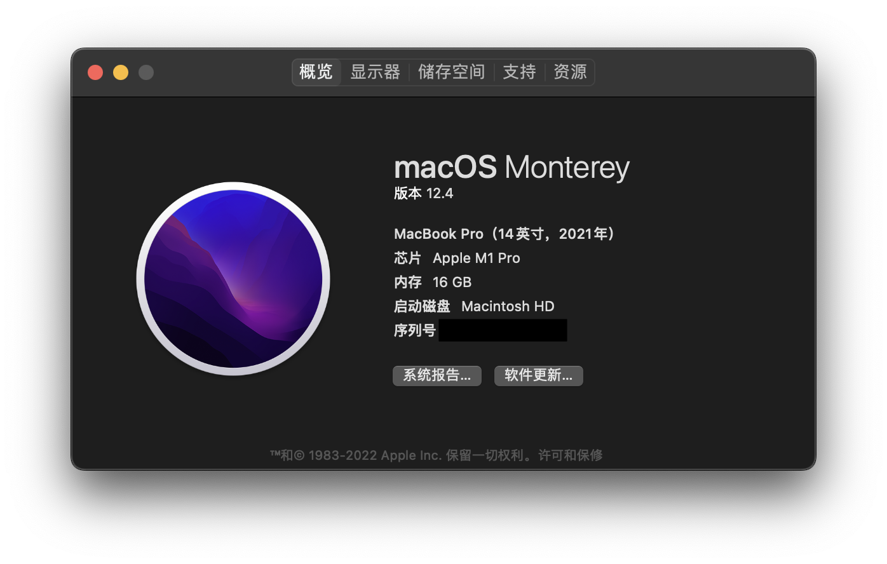
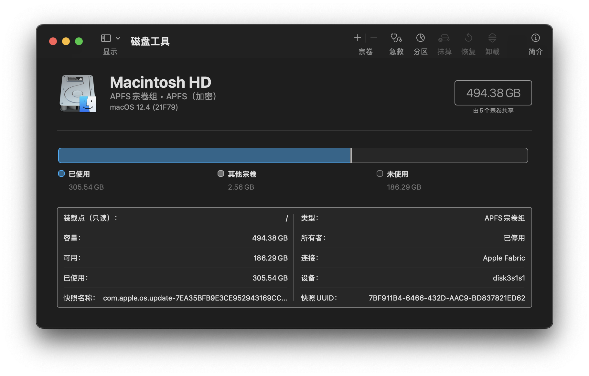

# 硬件基础

在之前的文章中，我们讲了一些计算机底层的数与表示的问题。在这篇文章中，我们主要讨论的是硬件基础。由于汇编语言实际上是底层硬件的一个抽象，因此，我并不想太多地涉及底层硬件，只想大致讲一下我们在汇编语言中常接触到的硬件相关知识。但这里要指出的是，实际上硬件层面远不止这么简单，甚至比软件层面还要复杂得多得多。

## CPU、内存与硬盘

打开我们的Mac的系统信息，我们可以看到处理器和内存型号：



在磁盘工具中，我们也可以看到硬盘的型号：



处理器（即CPU）、内存和硬盘，这三者究竟有什么关系呢？

通过一个简单的计算我们可以知道，一块硬盘的大小为512GB, 那么一共有512,000,000,000个存储单元，也就是约10的11次方个存储单元；一块内存的大小为16GB, 那么一共有16,000,000,000个存储单元，也就是约10的10次方个存储单元；而一块M1 Pro的CPU，由于采用ARM架构，因此一共有31个通用寄存器。

因此，一块硬盘的存储容量是一块内存的数十倍，是一个CPU的10,000,000,000倍！

那么，我们为什么要有这样的区分呢？能不能整个电脑的存储全用CPU的寄存器来做呢？答案是：理论上能，但实际上人类科技水平达不到，而且即使做出来也太贵了。我们从一个只有CPU，存储全靠寄存器的电脑入手，看如何能降低科技要求，削减开支。

CPU的功能是什么？是将寄存器中存储的值放到各种运算单元中进行处理。那么，我们在运行一个程序的时候，可能这个程序会有数以千计个变量，但是，在一段时间内参与运算的变量的个数却是非常少的，许多变量在参与运算后的很长一段时间内都不会再次参与运算。那么，我们不如只在CPU中保留少量的寄存器，用于存储当前参与运算的变量。然后将大部分不参与运算的变量存储在别的地方，在需要它们的时候再把它们导入到寄存器中。这就是内存(Memory)的功能。换句话说，CPU的功能主要是在寄存器中存储当前需要参与运算的变量，并可以用极高的速度将这些变量进行运算（从硬件层面上来讲，寄存器直连各种运算的器件）。当需要参与的变量不在寄存器中时，向内存发出访问申请，内存将变量导入CPU的寄存器中（这个时间与CPU寄存器参与运算的时间而言较慢）再参与运算。因此，内存的存储单元的速度可以比CPU的寄存器的慢一些，所以造价也就可以便宜一些。

那么运算全靠CPU，存储全靠内存，行不行呢？我们知道，在电脑中，不止有正在运行的程序，还有一些用于长期存储的文件。这些文件几乎很长时间才会运行一次。但是，CPU申请访问这些文件和申请访问那些经常运行的程序的优先级是相同的。这样的话，就会造成浪费。同时，CPU和内存也可以做到每次通电（也就是电脑启动）以后才会开始读写，一旦掉电（也就是电脑关机）那么所有数据就会消失。因此，我们将一些用于长期存储、电脑关机以后仍然需要保存的数据放到了硬盘(Disk)中，在程序运行的时候，将硬盘中的数据加载到内存中，再在CPU中参与运算。这样，硬盘的读写速度可以再进一步降低，成本也就进一步下降。

打个比方来说，硬盘、内存和CPU的关系就像是衣橱、工作台和针的关系。衣橱中存放的是已经编织好的衣服和一些毛线。当我们需要编织的时候，将毛线放在工作台上，然后用针穿起需要织的那一根线，进行编织。

## 存储单元

在内存和硬盘中，数据的存储的基本单位都是字节(Byte)。我们知道，在硬件中表示数据都是采用的二进制位，也就是`0`和`1`. 我们称每一位这样的二进制位为一个比特(Bit). 而一个字节，就是连续的八个比特。我们在汇编语言中，大部分情况下需要处理的最小的单位就是字节。一个字节，也可以看作是一个8位二进制数，或者一个2位16进制数。1字节常记做1B, 1比特常记做1b. 我们常用的单位还有KB(Kilobyte), KiB(Kibibyte), MB(Megabyte), MiB(Mebibyte)与GB(Gigabyte), GiB(Gibibyte). 严格来说，1KB=1000B, 1KiB=1024B, 1MB=1000KB, 1MiB=1024KiB, 1GB=1000MB, 1GiB=1024MiB. 在macOS以及iOS中采用的是这种标准的记法（可参考[iOS 和 macOS 如何报告储存容量](https://support.apple.com/zh-cn/HT201402#decimal)）。

内存和硬盘都是顺序编址。也就是说，我们要访问内存或者硬盘中的一个存储单元，那么就像我们想找人一样，首先要有它的名字。内存和硬盘给了每个存储单元（也就是一个字节）一个地址。相邻的存储单元的地址相邻。但是，内存和硬盘不同的一点在于，内存是随机访问(random access)的，也就是说，我想访问地址`0x0123456789abcdef`, 那么可以直接选择到这个地址，而不需要从`0`号地址开始向后找。最早期的硬盘则是要求顺序访问，也就是从某个特定的编号开始向后找。但后期的闪存技术可以弥补这一缺点。顺便提一句，内存这一随机访问的特点保证了顺序表（也就是C语言中的数组）的O(1)的查找复杂度。

AArch64架构下的CPU中，通用寄存器都是64位，也就是8个字节。由于CPU是老大，因此，程序啊什么的都是跟着CPU来的。因此，在AArch64架构下，有的数据的大小是64位。这在CPU内部的运算中没什么问题，但遇到与内存交互时就犯了难。比如说，我有一个数据`0x0123456789abcdef`, 如果要从CPU中导到内存中，内存是按字节编址，也就是1个字节对应1个地址。那么，这个数据应该怎么存储在内存中呢？是`01 23 45 67 89 ab cd ef`还是`ef cd ab 89 67 45 23 01`呢？这就涉及到了端序的概念：

```plaintext
little address ----------------> big address

big endian:
01 23 45 67 89 ab cd ef

little endian:
ef cd ab 89 67 45 23 01
```

事实上，AArch64可以同时支持大端序和小端序。在Apple Silicon中[用的是小端序](https://developer.apple.com/documentation/apple-silicon/porting-your-macos-apps-to-apple-silicon)：

> Both Apple silicon and Intel-based Mac computers use the little-endian format for data, so you don’t need to make endian conversions in your code. However, continue to minimize the need for endian conversions in custom data formats that you create.

当然，我们也可以写一个程序来轻松确认（代码可以参考[codes/3-endianness.c](https://github.com/Evian-Zhang/learn-assembly-on-Apple-Silicon-Mac/blob/master/codes/3-endianness.c)）：


## CPU

现在CPU技术越来越发达，因此相关的技术、术语也越来越多。在我们学习汇编语言的过程中，有必要将一些与CPU相关的术语弄清楚。

首先，每一个CPU都有其制造厂商与标准制定厂商。Apple Silicon的指令集架构标准是由ARM制定的，所以在某些场合，人们习惯将Mac分为Intel Mac与ARM Mac。

指令集架构（Instruction Set Architecture, ISA）描述了如何通过软件控制CPU，是软件与硬件之间的一个中介。ISA定义了包括支持的数据类型、寄存器、硬件如何操作主存储器等特性，可以参见[What Is an Instruction Set Architecture?](https://www.arm.com/glossary/isa)。总的来说，就是大部分和计算机体系结构相关的具体细节。

具体到我们目前使用的CPU而言，ARM推出了[ARMv8处理器架构](https://www.arm.com/architecture/cpu)。该架构分为三个Profile：

* ARMv8-A (Application)

   高性能处理器架构
* ARMv8-R (Real-Time)

   针对实时系统进行优化
* ARMv8-M (MicroController)

   针对小型、低能耗、高能效的设备

目前Apple Silicon使用的是ARMv8-A Profile。

ARMv8指令集架构包含两个执行状态：32位执行状态与64位执行状态。这两个执行状态分别能执行32位的应用程序与64位的应用程序。64位的执行状态被称为AArch64。在许多应用开发的过程中，也将AArch64称为指令集架构，意为64位的ARM指令集架构。

CPU可以执行的指令组成的集合被称为指令集（Instruction Set）。AArch64状态下的指令集为A64指令集。

此外，ARM也自己研发处理器，其处理器一般命名为Cortex系列。
