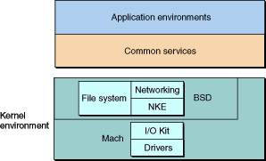
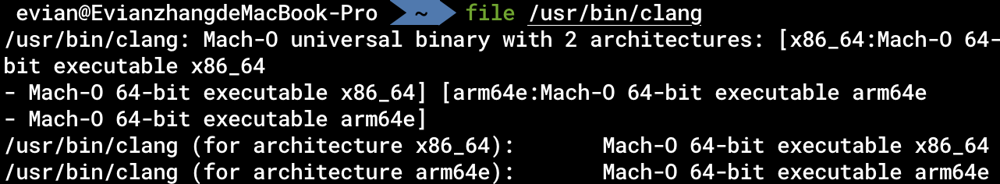
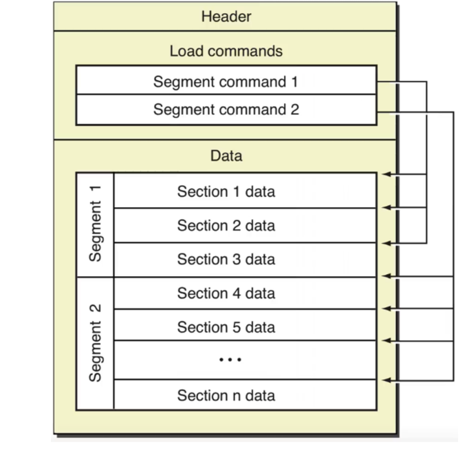
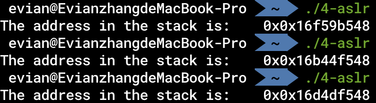

# 操作系统

当我们学习汇编的时候，除了数学基础以及硬件基础以外，操作系统的基础也是一个至关重要的环节。汇编语言本质上就是机器码的human-readable的版本，而硬件相同，则同一个程序的机器码一定相同。那么我们为什么还要研究操作系统呢？这是因为，我们通过汇编语言，最终得到的可执行文件是与操作系统有关的，是操作系统来决定我们如何装载、执行这些可执行文件。此外，不同操作系统提供的库、系统调用并不完全相同。因此，只有了解了操作系统以后，才能更好地编写汇编语言。

## Darwin与XNU

macOS的基本架构如下：


macOS建立在Darwin操作系统之上，以Aqua为图形化界面。Darwin操作系统的内核是XNU. 我们可以通过在终端下键入

```bash
uname -a
```

来查看Darwin和XNU的版本号。我在macOS 下的结果如下：


XNU是[开源的](https://github.com/apple-oss-distributions/xnu.git)，Aqua图形化界面是在Apple专利下的。

简单来讲就是，我们用的macOS里各种图案、交互都是Apple专利下的，而系统的运行、内存的分配等等底层的操作系统都是开源的。事实上，国外也有社区在提供基于Darwin操作系统的开源的系统，如[PureDarwin](http://www.puredarwin.org).

接下来，我们重点关注的是Darwin操作系统的内核——XNU.

正如上面macOS的基本结构的图中所示，XNU位于macOS的最底层——Kernel and Device Drivers. 下面这张高糊的图在Apple的[官方文档](https://developer.apple.com/library/archive/documentation/Darwin/Conceptual/KernelProgramming/Architecture/Architecture.html)中用于描述macOS内核架构：



总的来说，XNU是一个混合型内核，包括FreeBSD和Mach两层，是一个类Unix内核。

我们并不需要太过深入地了解XNU内核，只需要大致知道其分为FreeBSD和Mach两层。

## 系统调用

说了这么多，操作系统究竟能为我们做什么呢？更具体地说，我们在汇编语言中有什么可以利用操作系统的呢？事实上，操作系统可以为我们提供许多有用的「系统调用」(System call)。比如说，我们知道，一个进程由操作系统发起，由操作系统结束，那么，我们怎么在程序内部让操作系统来结束这个进程呢？再比如说，文件系统是由操作系统管理的，那么文件的读取和写入在用户层面怎么实现呢？这一切，都是由操作系统来提供的。从某种意义上来说，操作系统就和我们在高级编程中使用的Cocoa, React等一样，是一种「框架」(Framework)。我们在编程的时候，可以直接使用框架提供的API. 同样地，我们在编写汇编程序的时候，也可以直接使用操作系统提供的系统调用。就像是我们在用毛线织衣服的时候，并不需要自己来养蚕缫丝，只需要在毛线不够的时候向毛线的提供者说一句，然后就由毛线的提供者工作来提供毛线。关于系统调用，我们之后在汇编语言中还会详细阐释。

## 内存虚拟化

在上一篇「硬件基础」中，我们提到，所有进程都是在内存中运行的。现在常用的操作系统都采用了一个策略「内存虚拟化」，将逻辑地址与物理地址进行区分。我们知道，内存中的存储单元是以字节编址的，相邻的存储单元的地址相邻。这里实际指的是「物理地址」，也就是CPU在向内存发出访问请求时用到的地址。我们在编程中，遇到的地址都是「逻辑地址」。在一个进程启动时，操作系统会为每个进程分配64位逻辑地址空间，并在MMU(Memory Management Unit, 内存管理单元)中维护一个逻辑地址向物理地址的映射。也就是说，在我们编程时，物理地址对于程序员是透明的，程序员接触到的只会是物理地址。更具体地说，操作系统将地址分为4KiB, 也就是4096B大小的页(Page), 将逻辑地址的页与物理地址的页进行映射。在一个页内相邻的逻辑地址对应的物理地址是相邻的，但是页之间的物理地址的关系是不确定的。

64位逻辑地址空间，有多大呢？大约是18EB. EB是一种和KB, GB一样的单位，1EB是10的18次方字节。而据估算，2011年整个互联网的容量总和不超过525EB。因此，64位逻辑地址空间是非常非常大的，其总的大小远远大于实际的物理内存的大小。macOS为了解决这个问题，将一部分逻辑地址对应的页储存在硬盘上，准确地说，是`/boot`目录内。也就是说，当MMU在用逻辑地址向物理地址转化时，发现该逻辑地址在内存中没有对应物理地址，则将`/boot`目录内一部分数据调入内存中，作为那部分逻辑地址对应的存储空间。

## Mach-O文件结构

对于任何一个在macOS上的可执行文件，我们可以用`file`命令行工具检查它的格式：



由此可知，在macOS上的可执行文件，都是Mach-O格式的文件。

关于Mach-O文件，详细可参考Apple官方文档[Mach-O Programming Topics](https://developer.apple.com/library/archive/documentation/DeveloperTools/Conceptual/MachOTopics/0-Introduction/introduction.html). 这里我们只是简单介绍一下。



如图所示，Mach-O文件由头(Header)、装载指令(Load commands)和数据(Data)组成。我们可以通过[MachOView](https://github.com/fangshufeng/MachOView)软件进行查看。其中，最重要的组成部分就是Data.

我们可以从图中看到，Data可以分为多个段(Segment), 每个段又可以分为多个节(Section). 从逻辑角度来看，每个段内的节存储的数据都有类似的目的。如`__TEXT`段内存储的有汇编源代码、字符串等，`__DATA`段内存储非常量初始化变量等。从内存管理角度来看，每个段的大小被要求是页大小的倍数，也就是4096B的倍数。当程序加载时，就可以正好将一个段加载到一个页内。

## 栈

当程序运行时，系统会自动给这个进程分配一个栈。这里的栈的数据结构就是数据结构中所说的栈，也就是先进后出的线性表。在x86-64架构下，栈是向下生长的。也就是说，每向栈中`PUSH`一个数据，栈顶的指针就会向逻辑地址减小的方向移动。

## ASLR

从Mac OS X 10.5开始，Apple引入了地址空间配置随机加载(ASLR)机制。在每次程序执行的过程中，程序在内存中的开始地址，堆、栈、库的地址都会随机化，这样可以更好地保护不受攻击者攻击。

我们知道，在C语言中，局部变量是在栈上分配的。那么，我们有如下C语言程序：

```C
int main() {
    int a = 0;
    printf("The address in the stack is:\t0x%p\n", &a);
    return 0;
}
```

编译后运行三次：



我们可以发现，每次运行时，`a`的逻辑地址都不同。似乎是一个随机值加上一个固定的偏移量。这就是ASLR的作用。

## PIE

在ASLR中我们可以看到，大部分变量在每次运行时的逻辑地址都不一样。那么，我们在汇编层面访问这些变量时，就不能直接访问一个固定的逻辑地址。因此，我们在汇编语言中有许多技巧可以生成位置无关代码(Position Independent Code, PIC). 这些代码中没有一处会直接访问固定的逻辑地址。由位置无关代码编译生成的可执行文件称为位置无关可执行文件(Position Independent Executable, PIE). 在我们在macOS上的汇编语言学习过程中，大多数编写的都是PIC.
