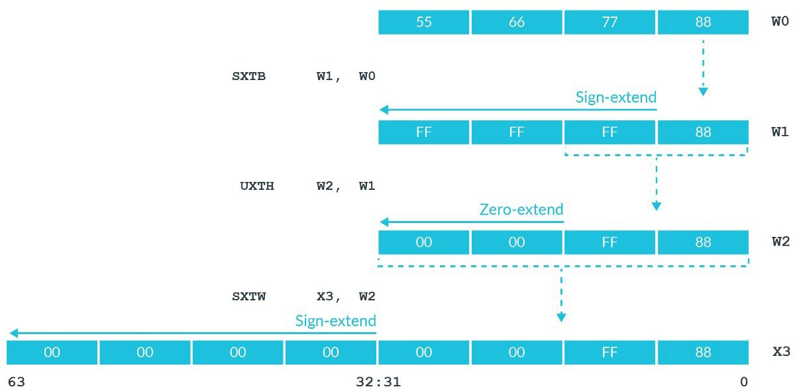

# 赋值指令

接下来几章将介绍A64指令集的一些基本指令操作。

首先我们来了解一下有哪些给寄存器赋值的指令。向寄存器赋值，理论上主要由三种方式：用常数给寄存器赋值、用另一个寄存器的值给寄存器赋值、用内存里的值给寄存器赋值。这里主要介绍前两者，关于从内存向寄存器赋值的一系列与内存交互的指令将在后续的章节统一介绍。

## 将一个寄存器的值赋值给另一个寄存器

这个过程非常简单，主要就是`mov`指令。

### 同宽度赋值

例如，`mov    w0, w1`可以将`w1`的值赋值给`w0`；`mov    x0, x1`可以将`x1`赋值给`x0`。

但值得注意的是，这些指令都只能在同样宽度的寄存器之间赋值。也就是说，我们不能通过`mov`指令，直接将`x0`的值赋给`w1`。这是为什么呢？

这是因为，在不同宽度寄存器之间的赋值，需要考虑扩展与截断的问题。

### 扩展

在[底层的整数](./1-底层的整数.md)一章中，我们讲到，在寄存器存储数的过程中，既可以把存储的值看作有符号整数，也可以把存储的值看作无符号整数。如果将寄存器存储的值看作无符号整数，那在不同宽度寄存器之间的赋值是非常简单且直接的。但是，如果把寄存器存储的值看作有符号整数，问题就变得复杂了起来。

假设我们`w0`寄存器存储的值为`0xFFFFFFFD`。如果想要将`w0`寄存器赋值给`x1`寄存器，我们想得到的结果是怎样的呢？

* 如果将`w0`寄存器存储的值看作无符号整数，则其存储的是十进制数4294967293。赋值给`x1`后，其同样也应该存储这个十进制数，因此`x1`寄存器存储的值应该是`0x00000000FFFFFFFD`。
* 如果将`w0`寄存器存储的值看作有符号整数，则其存储的是十进制数-3。赋值给`x1`后，其存储的同样也应该是`-3`。因此`x1`寄存器存储的值应该是`0xFFFFFFFFFFFFFFFD`。

根据上面的讨论，我们在从小宽度寄存器赋值给大宽度寄存器时，应当考虑其存储的数的意义。这种操作被称为**扩展**（Extension）。因此，AArch64架构下我们主要有两种扩展操作：有符号扩展`sxt`与无符号扩展`uxt`：

* 无符号扩展非常好理解，就是将源寄存器直接赋值给目的寄存器相应的部分，剩余的高位使用`0`进行填充。
* 有符号扩展则是，将源寄存器赋值给目的寄存器相应的部分，剩余的高位使用源寄存器的最高位进行填充。例如，`0xFFFFFFFD`二进制情况下最高位为`1`，因此剩余的高位将都用`1`进行填充。这种方式有效保证了源寄存器与目的寄存器的值，在有符号整数的意义下，符号和绝对值都是相同的。

这两类指令分别提供了三个指令供我们使用：`sxtb`、`sxth`、`sxtw`与`uxtb`、`uxth`、`uxtw`（事实上，`uxtw`有些特殊，该指令并没有在ARM官方文档中记录，汇编器也是将其翻译为`ubfx`指令）。

* 以`b`结尾的指令

   `b`代表byte。这类指令将源寄存器的最低位的一个字节赋值给目的寄存器，并进行相应的扩展。
* 以`h`结尾的指令

   `h`代表halfword。这类指令将源寄存器的最低位的两个字节赋值给目的寄存器，并进行相应的扩展。
* 以`w`结尾的指令

   `w`代表word。这类指令将源寄存器的最低位的四个字节赋值给目的寄存器，并进行相应的扩展。

根据这种描述，我们可以轻松推断出，这类指令的源操作数必须是32位寄存器，而目的操作数则可以是64位寄存器，也可以是32位寄存器（以`w`结尾的指令除外）。

官方教程中的这张图可以直观地理解这些指令：



### 截断

截断就是指，从大宽度的寄存器向小宽度的寄存器赋值。这一过程比较粗暴，就是直接将相应的部分赋值即可，不考虑任何符号因素。例如，如果想将`x0`的值赋值给`w1`，我们需要做的就是使用`mov    w1, w0`，也就是不考虑其高位，也不考虑其符号。

## 将常数赋值给寄存器

这个问题乍看起来非常简单呀，和寄存器给寄存器赋值操作应该很类似才对。然而，由于AArch64架构的原因，这个问题变得复杂起来。

我们知道，AArch64是定长指令集架构，其所有的指令在二进制层面长度都是32位。那么，我们怎样才能在定长指令集中编码这种常数赋值呢？如果是32位常数，肯定无法编码，因为指令总共长度才32位，至少还需要几位编码操作码与目的操作数吧。

因此，在AArch64架构下，真正的`mov`指令只能适用于少部分的情况。例如，如果我们写下这样的汇编语句：

```armasm
mov    w0, #0x114514
```

编译会得到这样的报错：

```shell
$ as test.s -o test.o
test.s:6:10: error: expected compatible register or logical immediate
        mov     w0, #0x114514
                    ^
```

为了解决这种情况，就要请出我们无敌的[`ldr`伪指令](https://developer.arm.com/documentation/dui0489/c/arm-and-thumb-instructions/pseudo-instructions/ldr-pseudo-instruction)了。

刚刚我们已经讨论过，在指令都是定长32位的情况下，必然不可能完整编码32位整数的赋值。因此，我们需要跳脱开来。`ldr`伪指令采取的策略就是，如果我们想要赋值的整数不能通过`mov`指令进行编码，那么就将这个整数存储在二进制镜像的数据区，然后产生一个内存读取指令，读取相应内存的数据即可（更严谨地来说，是一个PC-relative的地址，从而不用担心内存地址本身也是超过32位的数值这件事了）。

`ldr`伪指令的语法比较特殊，是`ldr    register, =expression`的形式。

例如，我们不妨来试验一下。在[codes/8-ldr-pseudo-instrution.s](https://github.com/Evian-Zhang/learn-assembly-on-Apple-Silicon-Mac/blob/master/codes/8-ldr-pseudo-instruction.s)文件，其核心内容如下：

```armasm
ldr    w0, =0x114514
```

我们对其编译、链接后的二进制文件`8-ldr-pseudo-instruction`文件进行反汇编：

```bash
otool -tvV 8-ldr-pseudo-insruction
```

可以看到这样的片段：

```plaintext
_main:
0000000100003fac	ldr	w0, 0x100003fb4
0000000100003fb0	ret
0000000100003fb4	.long	0x00114514
```

由此可见，`ldr`伪指令在`0x10003fb4`地址处生成了我们想要赋值的二进制数`0x114514`，随后生成一条内存读取指令`ldr    w0, 0x100003fb4`（事实上是PC-relative的，`otool`把它显式化了）。

这一做法，有效解决了`mov`指令无法编码所有32位操作数的困难。同时`ldr`伪指令会贴心地检查操作数是否可以被`mov`指令编码，如果可以，则直接使用`mov`指令。例如，`ldr    w0, =0`会生成`mov    w0, #0`，从而最大程度减少内存访问。

因此，当我们想用常数给寄存器赋值时，可以统一使用`ldr`伪指令。
